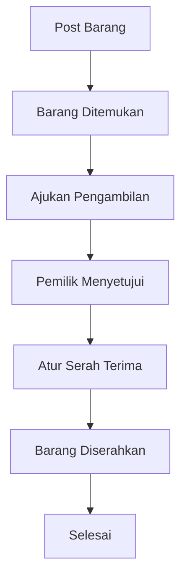
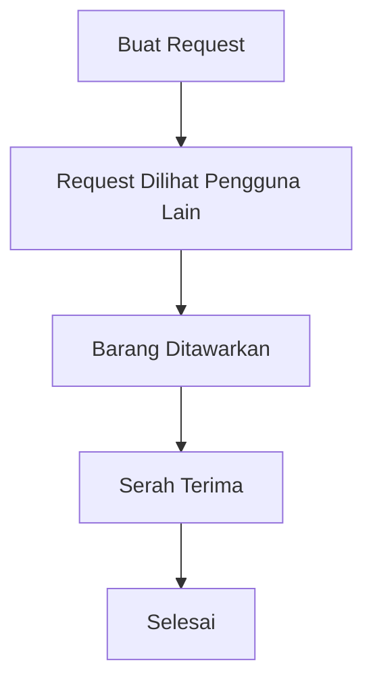

# ♻️ PakaiLagi

> **Berbagi barang yang masih layak pakai, agar dapat digunakan kembali oleh mereka yang membutuhkan.**

## About
**PakaiLagi** adalah platform berbagi barang secara gratis yang mempertemukan orang yang memiliki barang layak pakai dengan orang yang membutuhkannya.

PakaiLagi dapat digunakan oleh:

* Individu
* Rumah tangga
* Kantor
* Sekolah
* Organisasi
* Komunitas

Platform ini membantu memperpanjang masa guna barang dengan mempertemukan **pemberi barang** dan **penerima barang** dalam proses berbagi yang sederhana.

## Problem

Banyak barang yang masih layak digunakan berhenti terpakai karena pemiliknya sudah tidak membutuhkannya. Di sisi lain, ada orang lain yang sedang membutuhkan barang tersebut.

Tanpa wadah yang tepat, barang yang sebenarnya masih bernilai guna dapat tersimpan begitu saja atau akhirnya dibuang.

## Solution

PakaiLagi menyediakan ruang untuk:

* Membagikan barang yang sudah tidak digunakan secara gratis.
* Menemukan barang yang sedang dibutuhkan.
* Membuat request ketika barang yang dicari belum tersedia.
* Mengatur proses pengambilan dan serah terima antara pemberi dan penerima.

Dengan begitu, barang yang masih layak pakai memiliki kesempatan untuk **dipakai kembali oleh orang lain**.

## How It Works

### Memberikan Barang



### Membutuhkan Barang



## Pengambilan Barang

Setelah menemukan barang yang dibutuhkan, pengguna dapat mengajukan **Pengambilan**. Pemilik barang kemudian dapat melihat dan mengelola pengajuan tersebut.

Pemilik dapat:

* Melihat pengajuan.
* Menerima pengajuan.
* Menolak pengajuan.
* Memilih penerima apabila terdapat beberapa pengajuan.

### Metode Pengambilan

| Metode             | Penjelasan                                                                          |
| ------------------ | ----------------------------------------------------------------------------------- |
| **Ambil Langsung** | Penerima mengambil barang di lokasi pemberi.                                        |
| **Bertemu**        | Pemberi dan penerima menentukan lokasi pertemuan yang disepakati bersama.           |
| **Kurir**          | Barang dikirim menggunakan layanan kurir dengan biaya logistik ditanggung penerima. |

## Features

* Register & Login
* User Profile
* Tambah barang
* Edit barang
* Hapus barang
* Kategori barang
* Search
* Filter
* Detail barang
* Ajukan Pengambilan
* Persetujuan pengambilan
* Status barang
* Request barang
* Kontak pemberi dan penerima
* Pilihan metode pengambilan
* Riwayat aktivitas

## Status Barang

| Status      | Deskripsi                                            |
| ----------- | ---------------------------------------------------- |
| `AVAILABLE` | Barang tersedia dan dapat diajukan untuk diambil.    |
| `REQUESTED` | Terdapat pengajuan pengambilan terhadap barang.      |
| `RESERVED`  | Barang telah disetujui dan disiapkan untuk penerima. |
| `COMPLETED` | Proses serah terima barang telah selesai.            |

## Categories

PakaiLagi mendukung berbagai jenis barang yang masih layak digunakan, seperti:

* 👕 Pakaian
* 📚 Buku
* 🪑 Furniture
* 💻 Elektronik
* 🏠 Peralatan Rumah Tangga
* 🧸 Mainan
* 👶 Perlengkapan Bayi & Anak
* 🎒 Perlengkapan Sekolah
* 🏢 Perlengkapan Kantor
* 📦 Barang Layak Pakai Lainnya

## MVP

MVP berfokus pada core flow:

**Share → Find → Request → Approve → Handover → Complete**

Fitur utama dalam MVP:

* Authentication
* Posting barang
* Kategori
* Search & Filter
* Detail barang
* Request barang
* Pengajuan pengambilan
* Persetujuan pemilik
* Status barang
* Kontak pengguna
* Serah terima

## Tech Stack

```text
Frontend  : [Technology]
Backend   : [Technology]
Database  : [Technology]
Deployment: [Technology]
```

## Status

🚧 **In Development**

---

**PakaiLagi — Berbagi hari ini, digunakan kembali esok.**
